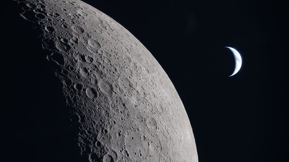
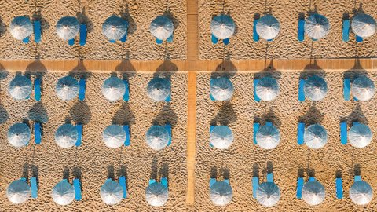

# Bing Wallpaper Archive

[中文](README.md) | English

Bing Wallpaper Archive is a personal archive for daily Bing 1080P wallpapers. It stores original images, thumbnails, metadata, and an index, then updates through GitHub Actions.

---

## Status

- Status: Active
- Version: v0.2.1
- Images: 1011
- Thumbnails: 1011
- Metadata records: 1011
- Date range: 2023-05-01 - 2026-07-19

---

## Latest Wallpaper

**Date:** 2026-07-19

**Title:** 月瞰寰宇

**Copyright:** 月球与地球由阿耳忒弥斯2号机组人员拍摄 (© NASA)

[](wallpapers/2026/07/20260719.jpg)

---

## Recent Wallpapers

| Date | Preview |
|---|---|
| 2026-07-19 | [](wallpapers/2026/07/20260719.jpg) |
| 2026-07-18 | [](wallpapers/2026/07/20260718.jpg) |
| 2026-07-17 | [](wallpapers/2026/07/20260717.jpg) |
| 2026-07-16 | [](wallpapers/2026/07/20260716.jpg) |
| 2026-07-15 | [](wallpapers/2026/07/20260715.jpg) |
| 2026-07-14 | [](wallpapers/2026/07/20260714.jpg) |
| 2026-07-13 | [](wallpapers/2026/07/20260713.jpg) |
| 2026-07-12 | [](wallpapers/2026/07/20260712.jpg) |
| 2026-07-11 | [](wallpapers/2026/07/20260711.jpg) |
| 2026-07-10 | [](wallpapers/2026/07/20260710.jpg) |
| 2026-07-09 | [](wallpapers/2026/07/20260709.jpg) |
| 2026-07-08 | [](wallpapers/2026/07/20260708.jpg) |

---

## Maintenance

Current maintained features:

- Daily Bing 1080P wallpaper download
- Thumbnail generation
- Metadata, hash, and index storage
- README generation
- Archive integrity checking

Historical migration tools were removed after archive completion.

---

## Data

- Original images: `wallpapers/YYYY/MM/YYYYMMDD.jpg`
- Thumbnails: `thumbnails/YYYY/MM/YYYYMMDD.jpg`
- Index: `data/index.json`
- Hash records: `data/hash.json`
- Metadata records: `data/metadata.json`
- Health report: `reports/archive_check.md`

Run locally:

```bash
python3 -m unittest discover -s tests -v
python3 scripts/check_archive.py
```

---

## License

MIT
